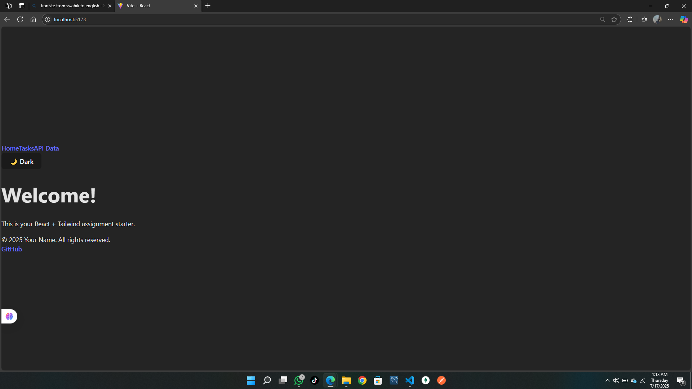
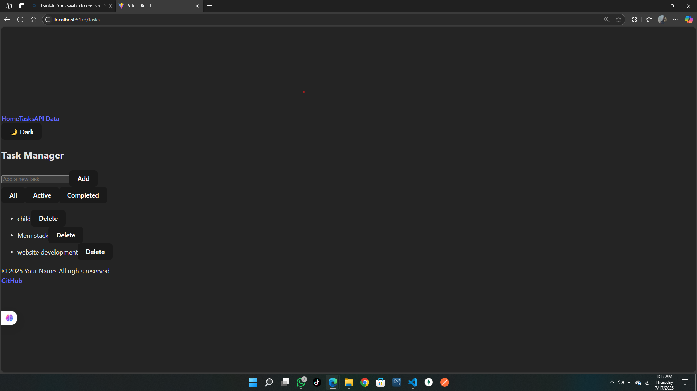
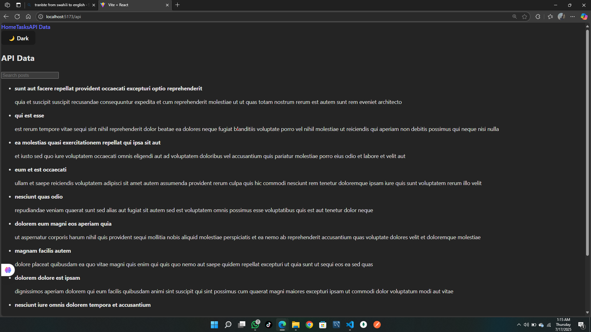

# Week 3 React.js, JSX, and Tailwind CSS Assignment

## 🌐 Deployment

This app is deployed at:  
[https://plp-mern-stack-development.github.io/week-3-react-js-assignment-Unbornmoral/](https://plp-mern-stack-development.github.io/week-3-react-js-assignment-Unbornmoral/)

## 🚀 Overview

This project is a responsive React application built with Vite and styled using Tailwind CSS. It demonstrates component architecture, state management with hooks, API integration, and theming (light/dark mode).

---

## 🛠️ Setup Instructions

1. **Clone the repository**
   ```sh
   git clone <your-repo-url>
   cd week-3-react-js-assignment
   ```

2. **Install dependencies**
   ```sh
   pnpm install
   ```
   or, if you use npm:
   ```sh
   npm install
   ```

3. **Start the development server**
   ```sh
   pnpm run dev
   ```
   or
   ```sh
   npm run dev
   ```

4. **Open your browser** and go to [http://localhost:5173](http://localhost:5173)

---

## 📁 Project Structure

```
src/
├── components/       # Reusable UI components (Button, Card, Navbar, Footer, TaskManager)
├── pages/            # Page components (Home, ApiData, NotFound)
├── hooks/            # Custom React hooks (useLocalStorage)
├── context/          # React context providers (ThemeContext)
├── layouts/          # Layout components (MainLayout)
├── api/              # API integration functions (optional)
├── utils/            # Utility functions (optional)
├── App.jsx           # Main application component
├── main.jsx          # Entry point
└── index.css         # Tailwind CSS imports
```

---

## ✨ Features

- **Reusable UI components:** Button, Card, Navbar, Footer
- **Task Manager:** Add, complete, delete, and filter tasks (All, Active, Completed)
- **API Integration:** Fetches and displays posts from JSONPlaceholder with search and pagination
- **Theme Switcher:** Toggle between light and dark mode
- **Responsive Design:** Works on mobile, tablet, and desktop
- **Tailwind CSS:** Utility-first styling and custom transitions

---

## 📸 Screenshots





---


---

## 📚 Resources

- [React Documentation](https://react.dev/)
- [Tailwind CSS Documentation](https://tailwindcss.com/)
- [React Router Documentation](https://reactrouter.com/)

---

## 📝 License

MIT
